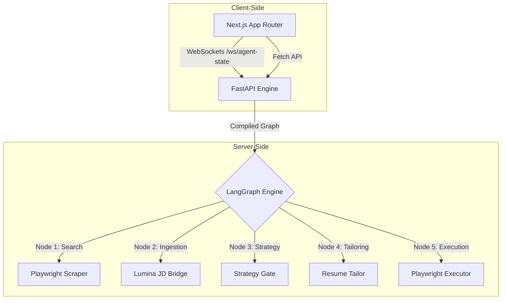

# MargApply SaaS — Core Agentic Job Hunting Engine 🤖💼

[](https://fastapi.tiangolo.com/)
[](https://nextjs.org/)
[](https://github.com/langchain-ai/langgraph)
[](https://playwright.dev/)
[](https://www.docker.com/)

MargApply is a next-generation autonomous job application SaaS. Using a advanced hybrid **LangGraph state machine** and **Playwright browser automation**, MargApply crawls, deconstructs, matches, and submits tailored applications on behalf of candidates.

---

## 🌟 Key Features

*   **Lumina Forensic JD Scanner**: Automatically decodes arbitrary job description text or URLs into structured schema profiles with accuracy.
*   **Intelligent Persona Mapping**: Automatically tailors the candidate's unique professional differentiators and overlapping skills against the targeted JD.
*   **Playwright Autonomous Submission**: Navigates complex job application portals and executes submission stubs automatically.
*   **Real-Time Graph Streaming**: Streams agent execution state step-by-step to the Next.js frontend over secure WebSockets.
*   **Interactive Strategy Gate**: Pauses before execution to allow the candidate to select alternative matched roles.
*   **Auto-Pilot Mode**: Bypass manual approvals via environment variables to let the agent apply autonomously 24/7.

---

## 📁 Monorepo Architecture



### `/backend` (FastAPI Core)
*   **`main.py`**: Compiles the 6-stage LangGraph workflow and handles WebSocket streaming.
*   **`search_agent.py`**: Playwright scraper that fetches real-time job listings in Bengaluru.
*   **`lumina_core.py`**: Integrates Groq LLMs (Llama 3.3) to forensically parse and match skills.

### `/frontend` (Next.js Application)
*   **`src/app`**: App Router page layouts, optimized with elegant fonts and dynamic transitions.
*   **`src/components`**: Custom UI components (Bento Grids, Pipeline Visualizers, Stats grids).
*   **`src/hooks`**: Handles WebSocket connections and real-time state synchronization.

---

## ⚙️ Local Development Setup

### Prerequisites
*   Python 3.11+
*   Node.js 18+
*   Git

### 1. Backend Setup
1. Navigate to the backend directory:
   ```bash
   cd backend
   ```
2. Create and activate a virtual environment:
   ```bash
   python -m venv .venv
   source .venv/bin/activate  # On Windows: .venv\Scripts\activate
   ```
3. Install dependencies:
   ```bash
   pip install -r requirements.txt
   ```
4. Install Playwright browsers:
   ```bash
   playwright install chromium
   ```
5. Configure environment variables in a `.env` file:
   ```env
   GROQ_API_KEY=your_groq_api_key
   AUTO_PILOT=false
   ```
6. Start the server:
   ```bash
   uvicorn main:app --reload --port 8000
   ```

### 2. Frontend Setup
1. Navigate to the frontend directory:
   ```bash
   cd ../frontend
   ```
2. Install npm packages:
   ```bash
   npm install
   ```
3. Start the Next.js development server:
   ```bash
   npm run dev
   ```
4. Open [http://localhost:3000](http://localhost:3000) to view the client dashboard.

---

## 🚀 Production Deployment

This monorepo is fully optimized for cloud deployments.

### Backend (Railway)
*   Deploys automatically via the root-level [Dockerfile](./Dockerfile).
*   **Environment Variables**:
    *   `PORT`: `8000` (automatically set by Railway)
    *   `GROQ_API_KEY`: *Your premium key*
    *   `AUTO_PILOT`: `true` (Enable to let the agent apply autonomously)

### Frontend (Vercel)
*   Point your Vercel project to the `/frontend` root directory and select the **Next.js** framework preset.
*   **Environment Variables**:
    *   `NEXT_PUBLIC_API_URL`: `https://your-backend.up.railway.app`

---

## 🤖 Triggering Auto-Pilot Mode
To switch the application from **Co-Pilot** (manual confirmation at the Strategy Gate) to **Auto-Pilot** (autonomous bulk applications):
1. Navigate to the **Railway Dashboard** under your backend service variables.
2. Toggle the `AUTO_PILOT` key to **`true`**.
3. Save changes. The agent will automatically redeploy and start applying autonomously!
